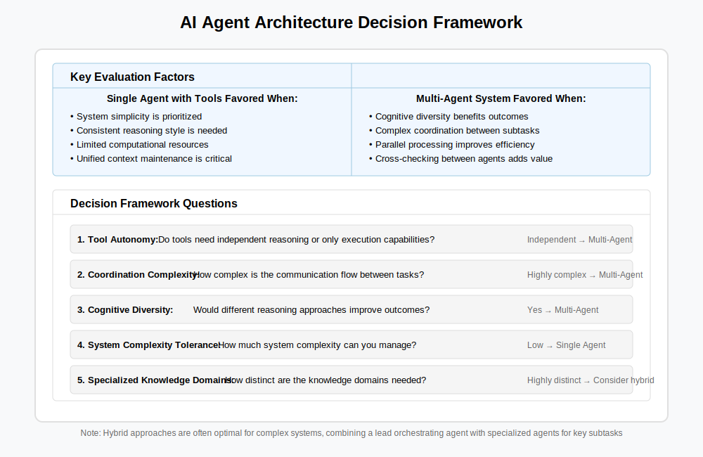

# A Single Agent with Tools vs. Multiple Agents

Architecting a non-trivial agentic system will require you reason about whether certain functionality is best expressed as a single agent with all the needed tools vs. multiple agents which in aggregate have access to the needed tools.

Like many problems in the real world, there can be multiple right answers and everything depends on the actual situation. It reminds me of decisions in software design - should this be one API call or two? Or should I do this part in the UI or in the service? There is not a single universal answer. Judgement and intuition are developed with experience - including sometimes by making decisions we later realize were suboptimal. Over time we develop heuristics and ask better questions that result in improved decision-making. So expect this page to evolve. 🤓

